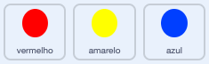

## Aumente a dificuldade

Agora você vai tornar o jogo mais difícil quanto mais tempo o jogador jogar. Você vai fazer isso fazendo com que as bolinhas apareçam mais rápido à medida que o tempo passa.

\--- task \---

Crie uma nova `variável`{:class="block3variables"} chamada 'atraso'.


\--- /task \---

\--- task \---

Vá para a área de scripts do Palco e crie um novo script que defina a variável `atraso`{:class="block3variables"} para `8` e então reduza lentamente o valor de `atraso`{:class="block3variables"} enquanto o jogo é executado.


```blocks3
    when flag clicked
    set [delay v] to (8)
    repeat until < (delay) = (2)>
        wait (10) seconds
        change [delay v] by (-0.5)
    end
```

\--- /task \---

Notice that this code is very similar to the code you would use to create a countdown timer!

Next, use the `delay`{:class="block3variables"} variable in the code scripts of the 'red', 'yellow', and 'blue' sprites.

\--- task \---

Remove the code block that makes the game wait a random number of seconds between making the dot sprite clones. Replace the block you've removed with your new `delay`{:class="block3variables"} variable:



```blocks3
<br />-   wait (pick random (5) to (10)) secs
    wait (delay :: variables) secs
```

Do this for all three dot sprites.

\--- /task \---

\--- task \---

Test the game, and check whether the dots begin to appear more quickly as the game goes on.

+ Does this work for all three coloured dots?
+ Can you see that the value of the `delay`{:class="block3variables"} variable decreases?

\--- /task \---