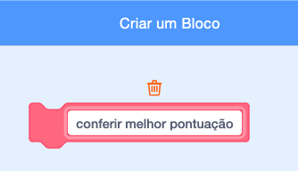

## Melhor pontuação

Você vai salvar a melhor pontuação do jogo, para que os jogadores possam ver como estão se saindo.

\--- task \---

Crie uma nova variável chamada `melhor pontuação`{:class="block3variables"}.


\--- /task \---

\--- task \---

Selecione o Palco. Clique em 'Meus blocos', e crie um novo bloco personalizado chamado `conferir melhor pontuação`{:class="block3myblocks"}.




\--- /task \---

\--- task \---

Adicione o código ao seu bloco personalizado para que o bloco verifique se o valor atual de `pontuação`{:class="block3variables"} é maior que o valor da variável `melhor pontuação`{:class="block3variables"}, e então armazena o valor de `pontuação`{:class="block3variables"} como o novo valor de `melhor pontuação`{:class="block3variables"}.


```blocks3
    define check high score
    if <(score :: variables) > (high score)> then
        set [high score v] to (score :: variables)
    end
```

\--- /task \---

\--- task \---

Adicione seu novo bloco personalizado ao script do Palco, antes do final do script.


```blocks3
when flag clicked
set [lives v] to (3)
set [score v] to (0)
wait until <(lives) < (1)>

+ check high score :: custom
stop [all v]
```

\--- /task \---

\--- task \---

Jogue seu jogo duas vezes para verificar se a sua pontuação é guardada corretamente como a `melhor pontuação`{:class="block3variables"}.

\--- /task \---