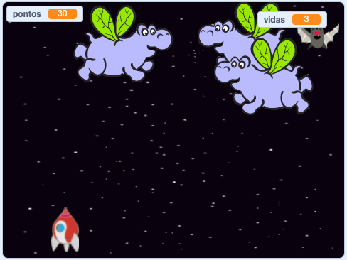

## E agora?

Experimente o projeto [Guerra dos Clones](https://projects.raspberrypi.org/pt-BR/projects/clone-wars?utm_source=pathway&utm_medium=whatnext&utm_campaign=projects) para criar um jogo no qual você tem que salvar a Terra dos monstros espaciais. Nesse projeto, você poderá usar o que aprendeu sobre clonar atores e adicionar uma pontuaçāo!

--- no-print ---

Clique na bandeira verde no jogo de exemplo abaixo para começar, e depois pressione as setas para <kbd>esquerda</kbd> e <kbd>direita</kbd> para mover a nave espacial, e a tecla de <kbd>espaço</kbd> para atirar.

  <iframe allowtransparency="true" width="485" height="402" src="https://scratch.mit.edu/projects/embed/400276792/?autostart=false" frameborder="0" scrolling="no"></iframe>
  

--- /no-print ---

Marque o máximo de pontos possível atirando em hipopótamos espaciais voadores. Se você for atingido por um hipopótamo ou por uma laranja derrubada pelos morcegos, você perde uma vida.

--- print-only ---

--- /print-only ---

***
Este projeto foi traduzido por voluntários:

Erivan Sousa

Marcos Omura

Miguel Nunes

Graças a voluntários, podemos dar às pessoas de todo o mundo a chance de aprender em seu próprio idioma. Você pode nos ajudar a alcançar mais pessoas oferecendo-se para traduzir - mais informações em rpf.io/translate.