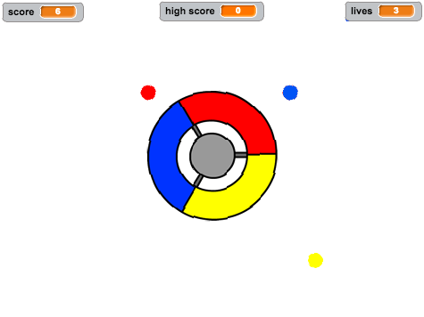

\--- no-print \---

Esta é a versão **Scratch 3** do projeto. Há também uma versão [Scratch 2 do projeto](https://projects.raspberrypi.org/en/projects/catch-the-dots-scratch2).

\--- /no-print \---

## Introdução

Neste projecto vais aprender a criar um jogo no qual o jogador tem que acertar pontos coloridos com a cor certa da roda controladora.

\--- no-print \--- Usa as setas do teclado para girar a roda controladora e pega os pontos voadores quando eles chegarem ao centro. Se perderes três pontos, o jogo acaba.

  <iframe allowtransparency="true" width="485" height="402" src="https://scratch.mit.edu/projects/embed/252923761/?autostart=false" frameborder="0" scrolling="no"></iframe>
  

\--- /no-print \---

\--- print-only \---  \--- /print-only \---

## \--- collapse \---

## title: O que vais aprender

+ Como escolher de uma lista itens ao acaso
+ How to use variables to track speed, lives, and the player's score

\--- /collapse \---

## \--- collapse \---

## title: What you will need

### Hardware

+ A computer capable of running Scratch 3

### Software

+ Scratch 3 (either [online](http://rpf.io/scratchon){:target="_blank"} or [offline](http://rpf.io/scratchoff){:target="_blank"})

### Downloads

+ [Offline Scratch 2 project](http://rpf.io/p/en/catch-the-dots-go){:target="_blank"} \--- /collapse \---

## \--- collapse \---

## title: Additional notes for educators

\--- no-print \--- If you need to print this project, please use the [printer-friendly version](https://projects.raspberrypi.org/en/projects/catch-the-dots/print). \--- /no-print \---

You can find [the completed project here](http://rpf.io/p/en/catch-the-dots-get){:target="_blank"}.

You can find the [completed project here](https://scratch.mit.edu/projects/252923761/#editor){:target="_blank"} \--- /collapse \---