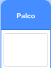

## Ganhar pontos ou perder vidas

Agora vais adicionar alguns pontos que o jogador precisa de apanhar.

\--- task \--- Cria um novo actor chamado 'vermelho'. Este actor deve ser um pequeno ponto vermelho.


\--- /task \---

\--- task \--- Adiciona este guiāo ao teu actor 'vermelho' para criar um novo clone do actor a cada poucos segundos:


```blocks3
    quando alguém clicar na bandeira verde
esconde-te
espera (2) s
repete para sempre 
  cria um clone de (myself v)
  espera (um valor ao acaso entre (5) e (10)) s
end
```

\--- /task \---

Se clicares na bandeira verde agora, vai parecer que nāo acontece nada. Isso é por todos os actores clonados estāo escondidos, e aparecem no mesmo sítio.

Vais adicionar código para que cada novo clone apareça num dos quatro cantos do Palco.


\--- task \--- Cria uma nova lista chamada `posições iniciais`{:class="block3variables"}, clica o icone `(+)` da lista para adicionar os valores `--180`{:class="block3variables"} e `180`{:class="block3variables"}.


[[[generic-scratch3-make-list]]]

Depois podes esconder a lista se deselecionares esta opçāo:

 \--- /task \---

Nota que as coordenadas para cada canto do Palco sāo uma combinaçāo de `180` e `-180`. Isso significa que podes usar a lista para escolher um canto do Palco ao acaso.

\--- task \--- Adiciona este código ao actor 'ponto' para que cada novo clone do actor apareça num canto ao acaso e depois lentamente se mova na direçāo do actor controlador.


```blocks3
    quando fores criado como um clone
vai para a posição x: ((um valor ao acaso entre (1) e (2)) de [start positions v]) y: ((um valor ao acaso entre (1) e (2)) de [start positions v])
aponta em direcção a (controller v)
mostra-te
até que <estás a tocar em (controller v)>, repete 
  anda (1) passos
end
```

\--- /task \--- Este novo código escolhe ou `-180` ou `180`o para as posições x e y, o que significa que cada actor 'ponto' começa num canto do Palco.

\--- task \--- Testa o teu projeto. Deves ver pontos vermelhos a aparecer nos cantos do Palco e moverem-se na direçāo do controlador.

 \--- /task \---

\--- task \--- Cria duas novas variáveis chamadas `vidas`{:class="block3variables"} e `pontuaçāo`{:class="block3variables"}.

 \--- /task \---

\--- task \--- Adiciona código ao teu Palco para alterar a variável `vidas`{:class="block3variables"} para `3` e `pontuaçāo`{:class="block3variables"} para `0` no inicio do jogo. 

```blocks3
quando alguém clicar na bandeira verde
altera [lives v] para (3)
altera [score v] para (0)
```

\--- /task \---

\--- task \--- Adiciona este código ao fim do guiāo do Palco para acabar o jogo quando o jogador perder a última das vidas:


```blocks3
    wait until <(lives :: variables) < [1]>
    stop [all v]
```

\--- /task \---

O jogador deve ganhar pontos por apanhar pontos. e deve perder vidas por falhar. Um 'ponto' só pode ser apanhado se a cor do controlador for a mesma do 'ponto'.

\--- task \--- Volta à área do guiāo do actor 'vermelho' para adicionar alguns blocos ao fim do guiāo `Quando fores criado como um clone`{:class="block3control"} do actor.

Primeiro, faz o clone do 'ponto' First, make the dot clone `anda 5 passos`{:class="block3motion"} para que se sobreponha ao controlador.

Depois adiciona código para ou adicionar `1` à `pontuaçāo`{:class="block3variables"} se a cor do clone 'ponto' for a mesma que a do controlador quando eles se tocam, ou tirar `1` de `vidas`{:class="block3variables"} se a cor for diferente.

[[[generic-scratch3-sound-from-library]]]


```blocks3
    anda (5) passos
    if <touching color [#FF0000]?> then
        change [score v] by (1)
        play sound (pop v) until done
    else
        change [lives v] by (-1)
        play sound (Laser1 v) until done
    end
    delete this clone
```

\--- /task \---

\--- task \---

Testa o teu jogo ter a certeza que:

1. Perdes uma vida se nāo acertares um 'ponto' com a cor correcta
2. Marcas um ponto se acertares com a cor correta

\--- /task \---