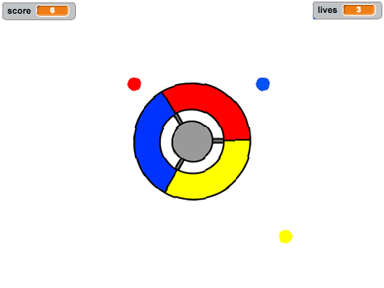

## Mais 'pontos'

\--- task \--- Duplica o teu actor 'ponto vermelho' duas vezes, e nomeia os dois novos actores de 'amarelo' e 'azul'.

 \--- /task \---

\--- task \--- Muda o traje de cada actor para a coe correta: o actor 'amarelo' deve ser amarelo, e o 'azul' azul. \--- /task \---

\--- task \--- Muda a cor de cada actor de maneira a que o jogador tenha que acertar o 'ponto' clone com a cor correta no controlador para marcar pontos.



\--- hints \--- \--- hint \--- Este é o oódigo que precisas de encontrar e alterar para ambos os actores:


```blocks3
    if <touching color [#FF0000]?> then
        change [score v] by (1)
        play sound (pop v)
        ...
    end
```

\--- /hint \--- \--- hint \--- This is how you need to change the code for the yellow sprite:

```blocks3
    if <touching color [#FFFF00]? :: +> then
        change [score v] by (1)
        play sound (pop v)
    end
```

This is how you need to change the code for the blue sprite:

```blocks3
    if <touching color [#0000FF]? :: +> then
        change [score v] by (1)
        play sound (pop v)
    end
```

\--- /hint \--- \--- /hints \--- \--- /task \---

If you play the game now, you can see that the dots sometimes get created one top of each other.

\--- task \--- Change the code for the 'yellow' dot sprite so that it waits four seconds after the flag is clicked before appearing.


```blocks3
    when flag clicked
    hide
+   wait (4) seconds
```


Then change the code for the 'blue' dot sprite so that it waits 6 seconds after the flag is clicked before appearing.

\--- /task \---