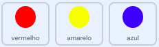

## Aumentar a dificuldade

Agora vais tornar o jogo mais difícil à medida que o jogador o for jogando. Fazes isso fazendo com que os pontos apareçam mais rápido à medida que o tempo passa.

\--- task \--- Cria uma nova `variável`{:class="block3variables"} chamada 'atraso'.

 \--- /task \---

\--- task \--- Vai para a área dos Guiões do Palco e cria um novo guiāo que altera a variável `atraso`{:class="block3variables"} para `8` e depois lentamente reduz o valor de `atraso`{:class="block3variables"} enquanto o jogo corre.


```blocks3
    Quando alguém clicar na bandeira verde
altera [delay v] para (8)
até que <(delay) = (2)>, repete 
  espera (10) s
  adiciona a [delay v] o valor (-0.5)
end
```

\--- /task \---

Nota que este código é muito parecido com o código que usarias para fazer um temporizador de contagem regressiva!

Em seguida, usa a variável `atraso`{:class="block3variables"} nos guiões de código dos actores 'vermelho', 'amarelo' e 'azul'.

\--- task \--- Remove o Código que faz o jogo esperar um valor de segundos ao acaso entre criar os clones dos actores ponto. Repõe o bloco que removeste com a tua nova variável `atraso`{:class="block3variables"}:



```blocks3
<br />-   espera (um valor ao acaso entre (5) e (10)) s
espera (delay :: variables) s
```

Faz isto para os três actores ponto.

\--- /task \---

\--- task \--- Testa o jogo, e verifica se os pontos começam a aparecer mais rapidamente à medida que o jogo avança.

+ Isto funciona com todos os três pontos coloridos?
+ Podes verificar que o valor da variável `atraso`{:class="block3variables"} diminui? \--- /task \---