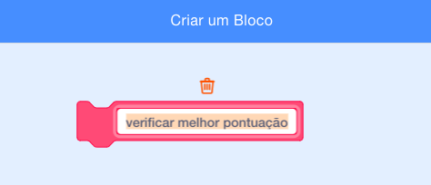

## Melhor pontuação

Vais guardar a melhor pontuaçāo do jogo, de modo que os jogadores possam avaliar o seu desempenho.

\--- task \--- Cria uma nova variável chamada `melhor pontuaçāo`{:class="block3variables"}.


\--- /task \---

\--- task \--- Seleciona o Palco. Clica em 'Os meus blocos' e cria um novo bloco personalizado chamado `cVerificar melhor pontuaçāo`{:class="block3myblocks"}.

 

\--- /task \---

\--- task \--- Adiciona código ao teu novo bloco personalizado para que ele verifique se o valor actual de `pontuaçāo`{:class="block3variables"} é maior que o valor da variável `melhor pontuaçāo`{:class="block3variables"}, e depois guarda o valor de `pontuaçāo`{:class="block3variables"} como novo valor de `melhor pontuaçāo`{:class="block3variables"}.


```blocks3
    Define check high score
se <(score :: variables) > (high score)> , então 
  altera [high score v] para (score :: variables)
end
```

\--- /task \---

\--- task \--- Add your new custom block to the Stage script before the end of the script.


```blocks3
Quando alguém clicar na bandeira verde
altera [lives v] para (3)
altera [score v] para (0)
espera até que <(lives) < (1)>

check high score :: custom
pára [all v]
```

\--- /task \---

\--- task \---

Joga o teu jogo duas vezes para verificar se a tua pontuaçāo é guardada corretamente como a `melhor pontuaçāo`{:class="block3variables"}.

\--- /task \---