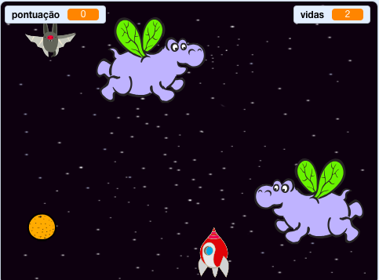

## O que se segue?

Experimenta o projeto '[Guerra de clones'](https://projects.raspberrypi.org/en/projects/clone-wars?utm_source=pathway&utm_medium=whatnext&utm_campaign=projects) para criares um jogo no qual tens de salvar a Terra de monstros espaciais. Nesse projeto, podes usar o que aprendeste acerca de clonar actores e ajuntar uma pontuaçāo!

\--- no-print \---

Clica na bandeira verde do exemplo do jogo abaixo para começar, e depois pressiona as teclas <kbd>seta para a esquerda</kbd> e <kbd>seta para a direita</kbd> para mover a nave espacial, e a tecla <kbd>espaço</kbd> para disparar.

  <iframe allowtransparency="true" width="485" height="402" src="https://scratch.mit.edu/projects/embed/276887163/?autostart=false" frameborder="0" scrolling="no"></iframe>
  

\--- /no-print \---

Pontua o máximo de pontos que puderes disparando sobre os hipo-espaciais voadores. Se fores atingido por um hipo ou por uma laranja largada pelos morcegos, perdes uma vida.

\--- print-only \---

\--- /print-only \---