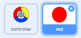
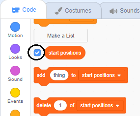

## Obțineți puncte sau pierdeți vieți

Acum veți adăuga câteva puncte pe care trebuie să le colecteze jucătorul.

\--- task \--- Creați un nou sprite numit "roșu". Acest personaj trebuie sa fie un mic punct rosu.



\--- /task \---

\--- task \--- Adăugați acest script la sprite "roșu" pentru a crea o nouă clona a sprite la fiecare câteva secunde:


```blocks3
    când pavilionul a făcut clic
    ascunde
    așteptați (2) secunde
    pentru totdeauna
        creați clona de (eu v)
        așteptați (alegeți aleatoriu (5) la (10)) secunde
    sfârșit
```

\--- /proba\---

Dacă faceți clic pe steagul verde acum, se pare că nu se întâmplă nimic. Acest lucru se datorează faptului că toți spritele clonate sunt ascunse și apar în același loc.

Veți adăuga un cod pentru ca fiecare nouă clonă să apară într-unul din cele patru colțuri ale scenei.


\--- task \--- Creați o nouă listă numită `poziții de început`{: class = "block3variables"}, faceți clic pe pictograma `(+)` a listei pentru a adăuga valorile `-180`{: class = "block3variables" } și `180`{: class = "block3variables"}.


[[[generic-scratch3-make-list]]]

Apoi, puteți ascunde lista prin deselectarea acestei casete:

 \--- /task \---

Observați că coordonatele pentru fiecare colț al scenei reprezintă o combinație de `180` și `-180`. Aceasta înseamnă că puteți utiliza lista pentru a alege un colț al scenei la întâmplare.

\--- task \--- Adăugați acest cod la sprite "dot" pentru a face fiecare clona nouă sprite să apară într-un colț aleatoriu și apoi să se deplaseze încet spre sprite-ul controlerului.


```blocks3
    atunci când pornesc ca o clonă
    mergeți la x: (element (alegeți aleatoriu (1) până la (2)) din [pozițiile de început v]) y: v])
    punct către (controler v)
    arată
    repetări până la <touching (controller v)?>
        deplasare (1) pași
    capăt
```

\--- / task \--- Acest nou cod alege fie `-180` sau `180` pentru pozitiile x si y, ceea ce inseamna ca fiecare clona sprite "punct" incepe intr-un colt al Scenelor.

\--- task \--- Testați-vă proiectul. Ar trebui să vedeți puncte roșii în colțurile scenei și să vă mișcați încet spre controler.

 \--- /task \---

\--- sarcină \--- Creați două variabile noi numite `vieți`{: class = "block3variables"} și `scoruri`{: class = "block3variables"}.

 \--- /task \---

\--- sarcină \--- Adăugați codul la etapa dvs. pentru a seta variabila `{`:: class = "block3variables"} la `3` și `scor`{: class = "block3variables"} la `0` la începutul jocului. 

```blocks3
când pavilionul a dat clic pe
set [trăiește v] la (3)
set [scor v] la (0)
```

\--- /task \---

\--- task \--- Adăugați acest cod la sfârșitul scriptului Stage pentru a face finalul jocului atunci când jucătorul își pierde ultima viață:


```blocks3
    așteptați până la <(vieți :: variabile) < [1]>
    stop [toate v]
```

\--- /task \---

Jucătorul ar trebui să câștige puncte pentru a prinde puncte și ar trebui să piardă vieți pentru că nu a reușit să prindă puncte. Un punct poate fi prins doar prin potrivirea culorii controlerului cu culoarea punctului.

\--- task \--- Întoarceți-vă la zona de scripturi "red" dot sprite pentru a adăuga câteva blocuri de coduri la sfârșitul sprite-ului `atunci când pornesc ca un script clone`{: class = "block3control"}.

Mai întâi, faceți clona de puncte `mutați 5 pași`{: class = "block3motion"} astfel încât să se suprapună controlerului.

Apoi adăugați codul pentru a adăuga `1` la `scor`clasa de culori a punctului corespunde culorii controlerului atunci când atinge sau pentru a lua `1` distanță de `vieți`{ : class = "block3variables"} dacă culorile lor nu se potrivesc.

[[[generic-scratch3-sound-from-library]]]


```blocks3
    mutare (5) Etapele
    dacă <touching color [#FF0000]?> apoi
        schimbare [scor v] de (1)
        sunet redare (pop v) până la făcut
    altceva
        schimbare [trăiește v] de (-1)
        sunet redare (Laser1 v) până la făcut
    sfârșitul
    ștergeți această clonă
```

\--- /task \---

\--- task \---

Test your game to make sure that:

1. You lose a life if you don’t match a dot with the correct colour
2. You score a point if you match a dot correctly

\--- /task \---