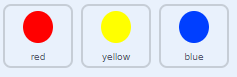

## Creșteți dificultatea

Acum vei face jocul mai dificil cu cât îl joacă mai mult. Veți face acest lucru făcând ca punctele să apară mai repede și mai repede în timp.

\--- Sarcina \--- Creează un nou `variabila`{: class = "block3variables"} numit 'întârziere'.

 \--- /task \---

\--- task \--- Mergeți în zona Scenelor Stage și creați un script nou care stabilește variabila `întârziere`{: class = "block3variables"} la `8` și apoi reduce încet valoarea de `întârziere`{: class = "block3variables"} în timp ce jocul rulează.


```blocks3
    când flag apasat
    set [întârziere v] până la (8)
    repetare până < (întârziere) = (2)>
        wait (10) secunde
        schimbare [întârziere v] de (-0.5)
    final
```

\--- /task \---

Observați că acest cod este foarte asemănător cu codul pe care l-ați folosi pentru a crea un cronometru de numărătoare inversă!

Apoi, utilizați variabila `întârziere`{: class = "block3variables"} în scripturile de cod ale spritelor "roșu", "galben" și "albastru".

\--- task \--- Eliminați blocul de cod care face jocul să aștepte un număr aleator de secunde între crearea clone-urilor sprite dot. Înlocuiți blocul pe care l-ați eliminat cu noua variabilă `întârziere`{: class = "block3variables"}:



```blocks3
<br />- așteptați (alegeți aleatoriu (5) până la (10)) secunde
    așteptați (întârziere :: variabile) secunde
```

Faceți asta pentru toate cele trei sprite.

\--- /task \---

\--- task \--- Testați jocul și verificați dacă punctele încep să apară mai repede pe măsură ce jocul continuă.

+ Acest lucru funcționează pentru toate cele trei puncte colorate?
+ Puteți vedea că valoarea variabilei `întârziere`{: class = "block3variables"} scade? \--- /task \---