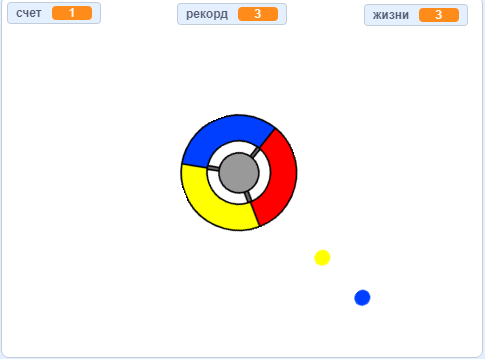

\--- no-print \---

Это версия проекта для **Scratch 3**. Есть также [версия для Scratch 2](https://projects.raspberrypi.org/en/projects/catch-the-dots-scratch2).

\--- /no-print \---

## Введение

В этом проекте ты узнаешь, как создать игру, в которой игроку нужно соединить цветные точки с правильной частью колеса контроллера.

\--- no-print \---

Используй клавиши со стрелками, чтобы вращать колесо контроллера и ловить летающие точки, пока они летят к центру. Если пропускаешь три точки - игра закончена.

  <iframe allowtransparency="true" width="485" height="402" src="https://scratch.mit.edu/projects/embed/252923761/?autostart=false" frameborder="0" scrolling="no"></iframe>
  

\--- /no-print \---

\--- print-only \---

\--- /print-only \---

## \--- collapse \---

## title: Чему ты научишься

+ Как выбрать случайные элементы из списка
+ Как использовать переменные, чтобы отслеживать скорость, жизни и счет игрока

\--- /collapse \---

## \--- collapse \---

## title: Что тебе понадобится

### Оборудование

+ Компьютер с поддержкой Scratch 3

### Программное обеспечение

+ Scratch 3 (either [online](https://rpf.io/scratchon){:target="_blank"} or [offline](https://rpf.io/scratchoff){:target="_blank"})

### Загрузки

+ [Offline Scratch 2 project](https://rpf.io/p/en/catch-the-dots-go){:target="_blank"}

\--- /collapse \---

## \--- collapse \---

## title: Дополнительные заметки для преподавателей

\--- no-print \---

Если вы хотите распечатать этот проект, то воспользуйтесь [версией для печати](https://projects.raspberrypi.org/en/projects/catch-the-dots/print).

\--- /no-print \---

You can find [the completed project here](https://rpf.io/p/en/catch-the-dots-get){:target="_blank"}.

\--- /collapse \---