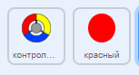
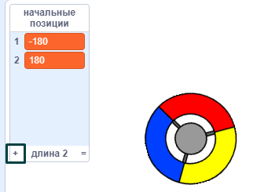
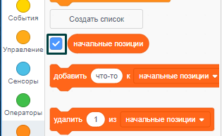

## Набирай очки или теряй жизни

Теперь ты добавишь точки, которые игрок должен будет собирать.

\--- task \---

Создай новый спрайт с именем 'красный'. Этот спрайт должен быть маленькой красной точкой.



\--- /task \---

\--- task \---

Добавь этот скрипт к спрайту "красный", чтобы каждые несколько секунд создавать новый клон спрайта:


```blocks3
    when flag clicked
    hide
    wait (2) seconds
    forever
        create clone of (myself v)
        wait (pick random (5) to (10)) secs
    end
```

\--- /task \---

Если нажмёшь на зелёный флажок сейчас, ничего не произойдет. Это потому, что все клонированные спрайты скрыты, и они появляются в одном и том же месте.

Ты добавишь код, который заставит каждый новый клон появляться в одном из четырех углов Сцены.


\--- task \---

Создай новый список с именем `начальные позиции`{:class="block3variables"}, нажми на значок `(+)` рядом со списком, чтобы добавить значения `-180`{:class="block3variables"} и `180`{:class="block3variables"}.




[[[generic-scratch3-make-list]]]

Потом ты можешь скрыть список, убрав плюс:



\--- /task \---

Обрати внимание, что координаты для каждого угла Сцены - это разные комбинации `180` и `-180`. Это означает, что ты можешь использовать список, чтобы выбирать угол Сцены случайным образом.

\--- task \---

Добавь этот код к спрайту «точка», чтобы каждый новый клон спрайта появлялся в случайном углу, а затем медленно приближался к спрайту контроллера.


```blocks3
    when I start as a clone
    go to x: (item (pick random (1) to (2)) of [start positions v]) y: (item (pick random (1) to (2)) of [start positions v])
    point towards (controller v)
    show
    repeat until <touching (controller v)?>
        move (1) steps
    end
```

\--- /task \---

Новый код выбирает или `-180` или `180` для x и y, благодаря чему каждый клон спрайта «точка» появляется в каком-нибудь из углов Сцены.

\--- task \---

Протестируй свой проект. В каждом углу Сцены должны появляться красные точки и медленно приближаться к контроллеру.


\--- /task \---

\--- task \---

Создай две новые переменные с именами `жизни`{:class="block3variables"} и `счёт`{:class="block3variables"}.


\--- /task \---

\--- task \---

Добавь код к Сцене, чтобы задать переменной `жизни`{:class="block3variables"} значение `3` и переменной `счёт`{:class="block3variables"} значение `0` в самом начале игры. 

```blocks3
when flag clicked
set [lives v] to (3)
set [score v] to (0)
```

\--- /task \---

\--- task \---

Добавь этот код в конец скрипта Сцены, чтобы игра заканчивалась, когда игрок теряет последнюю жизнь:


```blocks3
    wait until <(lives :: variables) < [1]>
    stop [all v]
```

\--- /task \---

The player should win points for catching dots, and should lose lives for failing to catch dots. A dot can only be caught by matching the colour of the controller to the colour of the dot.

\--- task \---

Go back to the 'red' dot sprite's Scripts area to add some code blocks to the end of the sprite's `when I start as a clone`{:class="block3control"} script.

First, make the dot clone `move 5 steps`{:class="block3motion"} so that it overlaps the controller.

Then add code to either add `1` to `score`{:class="block3variables"} if the colour of the dot clone matches the colour of the controller when they touch, or to take `1` away from `lives`{:class="block3variables"} if their colours don't match.

[[[generic-scratch3-sound-from-library]]]


```blocks3
    move (5) steps
    if <touching color [#FF0000]?> then
        change [score v] by (1)
        play sound (pop v) until done
    else
        change [lives v] by (-1)
        play sound (Laser1 v) until done
    end
    delete this clone
```

\--- /task \---

\--- task \---

Test your game to make sure that:

1. You lose a life if you don’t match a dot with the correct colour
2. You score a point if you match a dot correctly

\--- /task \---