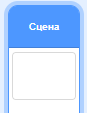

## Набирай очки или теряй жизни

Теперь ты добавишь точки, которые игрок должен будет собирать.

--- task ---

Создай новый спрайт с именем 'красный'. Этот спрайт должен быть маленькой красной точкой.


--- /task ---

--- task ---

Добавь этот скрипт к спрайту "красный", чтобы каждые несколько секунд создавать новый клон спрайта:


```blocks3
    when flag clicked
	  hide
	  wait (2) seconds
	  forever
		  create clone of (myself v)
		  wait (pick random (5) to (10)) secs
  	end
```

--- /task ---

Если нажмёшь на зелёный флажок сейчас, ничего не произойдет. Это потому, что все клонированные спрайты скрыты, и они появляются в одном и том же месте.

Ты добавишь код, который заставит каждый новый клон появляться в одном из четырех углов Сцены.


--- task ---

Создай новый список с именем `начальные позиции`{:class="block3variables"}, нажми на значок `(+)` рядом со списком, чтобы добавить значения `-180`{:class="block3variables"} и `180`{:class="block3variables"}.


[[[generic-scratch3-make-list]]]

Потом ты можешь скрыть список, убрав плюс:


--- /task ---

Обрати внимание, что координаты для каждого угла Сцены - это разные комбинации `180` и `-180`. Это означает, что ты можешь использовать список, чтобы выбирать угол Сцены случайным образом.

--- task ---

Добавь этот код к спрайту «точка», чтобы каждый новый клон спрайта появлялся в случайном углу, а затем медленно приближался к спрайту контроллера.


```blocks3
    when I start as a clone
	  go to x: (item (pick random (1) to (2)) of [начальные позиции v]) y: (item (pick random (1) to (2)) of [начальные позиции v])
	  point towards (контроллер v)
	  show
	  repeat until <touching (контроллер v)?>
		  move (1) steps
	  end
```

--- /task ---

Новый код выбирает или `-180` или `180` для x и y, благодаря чему каждый клон спрайта «точка» появляется в каком-нибудь из углов Сцены.

--- task ---

Протестируй свой проект. В каждом углу Сцены должны появляться красные точки и медленно приближаться к контроллеру.


--- /task ---

--- task ---

Создай две новые переменные с именами `жизни`{:class="block3variables"} и `счёт`{:class="block3variables"}.


--- /task ---

--- task ---

Добавь код к Сцене, чтобы задать переменной `жизни`{:class="block3variables"} значение `3` и переменной `счёт`{:class="block3variables"} значение `0` в самом начале игры. 


```blocks3
when flag clicked
set [жизни v] to (3)
set [счёт v] to (0)
```

--- /task ---

--- task ---

Добавь этот код в конец скрипта Сцены, чтобы игра заканчивалась, когда игрок теряет последнюю жизнь:


```blocks3
    wait until <(жизни :: variables) < [1]>
	  stop [all v]
```

--- /task ---

Игрок должен выигрывать очки за то, что ловит точки, и терять жизни, когда не может их поймать. Точку можно поймать только подставляя контроллер стороной с нужным цветом так, чтобы он совпадал с цветом точки.

--- task ---

Вернись к скрипту спрайта красной точки, чтобы добавить несколько блоков кода в конец скрипта `когда я начинаю как клон`{:class="block3control"}.

Сначала заставь клон точки `перейти на 5 шагов`{:class="block3motion"} так, чтобы он перекрывал контроллер.

Затем добавь код, который прибавляет либо `1` к `счёту`{:class="block3variables"}, если цвет клона точки совпадает с цветом контроллера при касании, либо отнимает `1` от количества `жизней`{:class="block3variables"}, если цвета не совпадают.

[[[generic-scratch3-sound-from-library]]]


```blocks3
  move (5) steps
	if <touching color [#FF0000]?> then
		change [счёт v] by (1)
		play sound (pop v) until done
	else
		change [жизни v] by (-1)
		play sound (Laser1 v) until done
	end
	delete this clone
```

--- /task ---

--- task ---

Проверь свою игру, чтобы убедиться, что:

1. Игра отнимает одну жизнь, если цвет точки и контроллера не совпадает
2. Добавляется очко, если цвета совпадают

--- /task ---