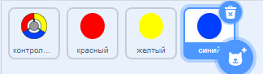
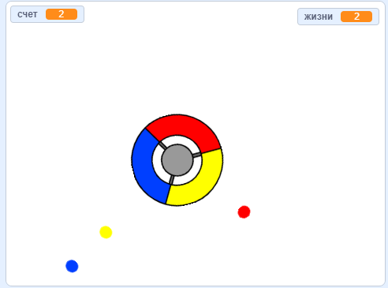

## Больше точек

\--- task \---

Продублируй «красный» спрайт дважды и назови два новых спрайта «желтый» и «синий».



\--- /task \---

\--- task \---

Измени костюм каждого нового спрайта так, чтобы он был правильного цвета: «жёлтый» спрайт должен быть жёлтым, а «синий» спрайт должен быть синим.

\--- /task \---

\--- task \---

Измени код каждого спрайта, чтобы игрок должен был подставлять часть контроллера нужного цвета под нужные клоны точек, чтобы набирать очки.



\--- hints \---

\--- hint \---

Вот код, который нужно найти и изменить для обоих новых спрайтов:


```blocks3
    if <touching color [#FF0000]?> then
        change [score v] by (1)
        play sound (pop v)
        ...
    конец
```

\--- /hint \---

\--- hint \---

Вот как нужно изменить код для жёлтого спрайта:

```blocks3
    if <touching color [#FFFF00]? :: +> then
        change [score v] by (1)
        play sound (pop v)
    end
```

Вот как нужно изменить код для синего спрайта:

```blocks3
    if <touching color [#0000FF]? :: +> then
        change [score v] by (1)
        play sound (pop v)
    end
```

\--- /hint \---

\--- /hints \---

\--- /task \---

If you play the game now, you can see that the dots sometimes get created on top of each other.

\--- task \---

Измени код спрайта для «жёлтой» точки, чтобы он ждал четыре секунды после нажатия на флаг, перед тем, как появиться.


```blocks3
    when flag clicked
    hide
+   wait (4) seconds
```


Измени код спрайта для «синей» точки, чтобы он ждал шесть секунд после нажатия на флаг, перед тем, как появиться.

\--- /task \---