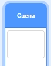
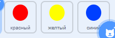

## Усложни игру

Теперь, чем дольше игрок играет в игру, тем сложнее она будет становиться. Мы сделаем это, если точки будут появляться всё быстрее и быстрее с течением времени.

\--- task \---

Создай новую `переменную`{:class="block3variables"} с именем "задержка".



\--- /task \---

\--- task \---

Перейди в область скриптов Сцены и создай новый скрипт, который устанавливает переменной `задержка`{:class="block3variables"} значение `8`, а затем медленно уменьшает `задержку`{:class="block3variables"} с течением игры.


```blocks3
    when flag clicked
    set [delay v] to (8)
    repeat until < (delay) = (2)>
        wait (10) seconds
        change [delay v] by (-0.5)
    end
```

\--- /task \---

Обрати внимание, что этот код очень похож на тот, который мы использовали для создания таймера обратного отсчета!

Далее используй переменную `задержка`{:class="block3variables"} в скриптах кода спрайтов 'красный', 'желтый' и 'синий'.

\--- task \---

Удали блок кода, который заставляет игру ждать произвольное количество секунд между созданием спрайтов-клонов для точек. Замени блок, который ты удалил, новой переменной `задержка`{:class="block3variables"}:



```blocks3
<br />-   wait (pick random (5) to (10)) secs
    wait (delay :: variables) secs
```

Сделай так для всех трех спрайтов точек.

\--- /task \---

\--- task \---

Проверь игру и убедись, что точки появляются быстрее по ходу игры.

+ Это работает для точек всех цветов?
+ Ты заметил, что значение переменной `задержка`{:class="block3variables"} уменьшается?

\--- /task \---