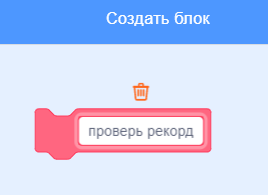

## Рекорд

Теперь мы сохраним рекорд игры, чтобы игроки могли оценить свои успехи.

\--- task \---

Создай новую переменную с именем `рекорд`{:class="block3variables"}.


\--- /task \---

\--- task \---

Выбери Сцену. Перейди в «Другие блоки» и создай новый пользовательский блок с именем `проверь рекорд`{:class="block3myblocks"}.




\--- /task \---

\--- task \---

Добавь код в свой пользовательский блок так, чтобы блок проверял, является ли текущее значение `счёта`{:class="block3variables"} больше значения переменной `рекорд`{:class="block3variables"}, а затем сохраняет значение `счёта`{:class="block3variables"} в переменной `рекорд`{:class="block3variables"}.


```blocks3
    define check high score
    if <(score :: variables) > (high score)> then
        set [high score v] to (score :: variables)
    end
```

\--- /task \---

\--- task \---

Добавь свой новый пользовательский блок в конец скрипта Сцены.


```blocks3
when flag clicked
set [lives v] to (3)
set [score v] to (0)
wait until <(lives) < (1)>

+ check high score :: custom
stop [all v]
```

\--- /task \---

\--- task \---

Сыграй в игру дважды, чтобы проверить, правильно ли сохраняется счёт, как `рекорд`{:class="block3variables"}.

\--- /task \---