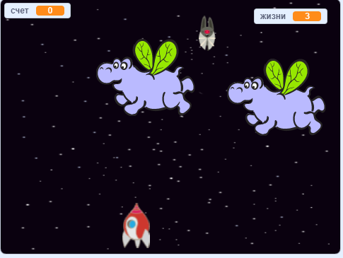

## Что дальше?

Попробуй проект [Войны клонов](https://projects.raspberrypi.org/ru-RU/projects/clone-wars?utm_source=pathway&utm_medium=whatnext&utm_campaign=projects), где ты сделаешь игру, в которой тебе нужно будет спасти Землю от космических монстров. В этом проекте ты сможешь использовать то, что узнал о клонировании спрайтов и добавлении счёта!

--- no-print ---

Нажми на зелёный флаг в примере игры ниже, чтобы начать, а затем нажми на клавиши <kbd>влево</kbd> и <kbd>вправо</kbd>, чтобы перемещать космический корабль и клавишу <kbd>пробел</kbd>, чтобы стрелять.

  <iframe allowtransparency="true" width="485" height="402" src="https://scratch.mit.edu/projects/embed/364067793/?autostart=false" frameborder="0" scrolling="no"></iframe>
  

--- /no-print ---

Набери как можно больше очков, стреляя в космических бегемотов. Если тебя ударит бегемот или в тебя попадет апельсин, брошенный летучими мышами, ты потеряешь жизнь.

--- print-only ---

--- /print-only ---

***
Этот проект был переведен волонтерами:

Мария Гапоник

Максим Рябцев

Благодаря волонтерам мы можем дать возможность людям во всем мире учиться на их родном языке. Вы можете помочь нам привлечь больше волонтёров-переводчиков - подробнее на [rpf.io/translate](https://rpf.io/translate).