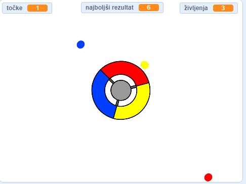

\--- no-print \---

To je ** Scratch 3 ** različica projekta. Obstaja tudi [Scratch 2](https://projects.raspberrypi.org/en/projects/catch-the-dots-scratch2) različica projekta.

\--- /no-print \---

## Uvod

V tem projektu se boš naučil ustvariti igro, v kateri mora igralec ujeti obarvane pike s pomočjo enako obarvanega dela krmila.

\--- no-print \--- Za vrtenje krmila uporabi smerne tipke in ujemi pike, ko dosežejo središče. Če zgrešiš tri pike, se igra konča.

  <iframe allowtransparency="true" width="485" height="402" src="https://scratch.mit.edu/projects/embed/252923761/?autostart=false" frameborder="0" scrolling="no"></iframe>
  

\--- /no-print \---

\--- print-only \---  \--- /print-only \---

## \--- collapse \---

## title: Kaj se boš naučil?

+ Kako izbrati naključne elemente iz seznama
+ Kako uporabljati spremenljivke za nadzor hitrosti, življenj in igralčevih točk

\--- /collapse \---

## \--- collapse \---

## title: Kaj boš potreboval?

### Strojna oprema

+ Računalnik, ki lahko poganja Scratch 3

### Programsko opremo

+ Scratch 3 (bodisi [na spletu](http://rpf.io/scratchon) {:target = "_blank"} ali [brez povezave](http://rpf.io/scratchoff){:target = "_blank"})

### Prenosi

+ [Namizni Scratch 2 projekt](http://rpf.io/p/en/catch-the-dots-go){:target="_blank"} \--- /collapse \---

## \--- collapse \---

## title: Dodatne informacije za izobraževalce

\--- Za tiskanje tega projekta, prosimo uporabite [tiskalniku prijazno različico](https://projects.raspberrypi.org/en/projects/catch-the-dots/print). \--- /no-print \---

Zaključen projekt lahko najdete [tukaj](http://rpf.io/p/en/catch-the-dots-get)"}.

Zaključen projekt lahko najdete [tukaj](https://scratch.mit.edu/projects/252923761/#editor)"}{:target="_blank"} \--- /collapse \---