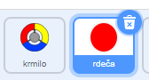
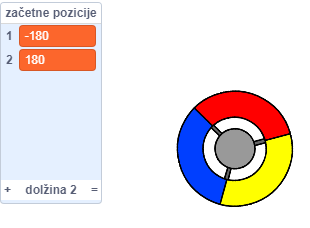
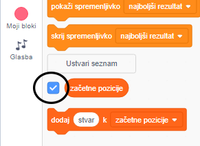
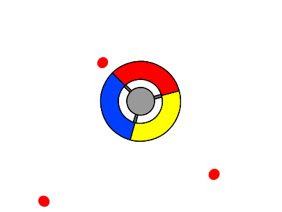

## Pridobi točke ali izgubi življenje

Sedaj boš dodal nekaj pik, ki mora igralec zbirati.

--- task ---

Ustvari novo figuro, imenovano 'rdeča'. Ta figura bi morala biti mala rdeča pika.



--- /task ---

--- task ---

Figuri 'rdeča' dodaj sledeče ukaze, da bi vsakih nekaj sekund ustvaril dvojnika figure:


```blocks3
  when flag clicked
	hide
	wait (2) seconds
	forever
		create clone of (myself v)
		wait (pick random (5) to (10)) secs
	end
```

--- /task ---

Če sedaj klikneš na zeleno zastavico, se zdi, kot da se ni zgodilo ničesar. Razlog je v temu, da so vsi dvojniki figure skriti in da se vsi nahajajo na istem mestu.

Sedaj boš dodal kodo, ki bo poskrbela, da se bo vsak nov dvojnik pojavil v enem od štirih kotov odra.


--- task ---

Ustvari nov seznam in ga poimenuj `začetne pozicije`{:class="block3variables"}. Klikni na `(+)` ikono seznama, da dodaš vrednosti `-180`{:class="block3variables"} in `180`{:class="block3variables"}.




[[[generic-scratch3-make-list]]]

Nato lahko skriješ seznam, tako da odznačiš ta kvadratek:



--- /task ---

Opazil boš, da sta koordinati za vsak kot odra kombinaciji števil `180` in `-180`. To pomeni, da lahko uporabiš seznam, za naključno izbiranje kota odra.

--- task ---

Dodaj to kodo v figuro 'pika', da se vsak dovjnik figure pojavi v naključno izbranem kotu in se nato počasi ponika proti figuri krmila.


```blocks3
  when I start as a clone
	go to x: (item (pick random (1) to (2)) of [začetne pozicije v]) y: (item (pick random (1) to (2)) of [začetne pozicije v])
	point towards (krmilo v)
	show
	repeat until <touching (krmilo v)?>
		move (1) steps
	end
```

--- /task ---

Ta nova koda izbere ali `-180` ali `180` za naslednji x in y poziciji, kar pomeni, da vsak dvojnik 'pike' začne svojo pot v enem od kotov odra.

--- task ---

Preizkusi projekt. Moral bi videti rdeče pike, ki se pojavljajo v kotih odra in se počasi pomikajo proti krmilu.



--- /task ---

--- task ---

Ustvari dve novi spremenljivki imenovani `življenja`{:class="block3variables"} in `točke`{:class="block3variables"}.


--- /task ---

--- task ---

Odru dodaj kodo, ki ob pričetku igre nastavi spremenljivko `življenja`{:class="block3variables"} na `3` in `točke`{:class="block3variables"} na `0`. 


```blocks3
when flag clicked
set [življenja v] to (3)
set [točke v] to (0)
```

--- /task ---

--- task ---

Na konec programa odra dodaj še to kodo, ki bo končala igro, kadar igralec izgubi še zadnje življenje:


```blocks3
    wait until <(življenja :: variables) < [1]>
	  stop [all v]
```

--- /task ---

Igralec bi moral dobivati točke, kadra ulovi pike in izgubljati življenja, kadar ne uspe uloviti pik. Piko lahko ujame le z tisim delom krmila, ki je barvno usklajen s piko.

--- task ---

Vrni se na ukaze v figuri 'rdeča' in dodaj nekaj blokov kode za ukazi, ki sledijo bloku `ko začnem kot dvojnik`{:class="block3control"}.

Najprej poskrbi, da se dvojnik pike `premakne 5 korakov`{:class="block3motion"}, zato da prekrije krmilo.

Potem dodaj kodo, ki bodisi doda `1` spremenljivki `točke`{:class="block3variables"}, če se barva pike ujema z barvo krmila, ko se dotakneta, bodisi odvzame `1` spremenljivki `življenja`{:class="block3variables"}, kadar se barvi ne ujemata.

[[[generic-scratch3-sound-from-library]]]


```blocks3
  move (5) steps
	if <touching color [#FF0000]?> then
		change [točke v] by (1)
		play sound (pop v) until done
	else
		change [življenja v] by (-1)
		play sound (Laser1 v) until done
	end
	delete this clone
```

--- /task ---

--- task ---

Preizkusi svojo igor in se prepričaj, da:

1. izgubiš življenje, če se barvi pike in krmila ne ujemata;
2. dobiš piko, če se barvi ujemata.

--- /task ---