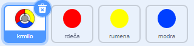
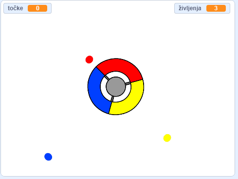
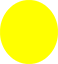

## Več pik

--- task ---

Dvakrat podvoji figuro pike 'rdeča' in novi figuri poimenuj 'rumena' in 'modra'.



--- /task ---

--- task ---

Spremeni videz novih figur, da bosta prave barve: 'rumena' naj bo rumena, 'modra' naj bo modra.

--- /task ---

--- task ---

Spremeni kodo obeh figur na način. da bo igralec moral ujeti dvojnika pike s pravilno barvo krmila, da bi dobil točke.



--- hints ---


--- hint ---

To je koda, ki jo moraš poiskati in prilagoditi figurama:


```blocks3
      če <se dotika barve [#FF0000]?>
    spremeni [točke v] za (1)
    predvajaj zvok (pop) do konca
    ...
    konec
```

--- /hint ---

--- hint ---

Kodo za rumeno figuro moraš spremeniti na takšen način:

```blocks3
      če <se dotika barve [#FFFF00]? :: +> potem
    spremeni [točke v] za (1)
    predvajaj zvok (pop v)
  konec
```

Tako moraš spremeniti kodo za modro figuro:

```blocks3
    če <se dotika barve [#0000FF]? :: +> potem
    spremeni [točke v] za (1)
    predvajaj zvok (pop v)
  konec
```

--- /hint ---

--- /hints ---

--- /task ---

Če sedaj igraš svojo igro, boš videl, da da se pike včasih ustvarijo ena vrh druge.

--- task ---

Spremeni kodo za figuro pike 'rumena', da bo počakala štiri sekunde, po kliku na zastavico, preden se bo pojavila.



```blocks3
    ko kliknemo na zastavico
  skrij
+   počakaj (4) sekund
```


Nato spremeni kodo za figuro 'modra' pika, da bo počakala 6 sekund po kliku na zastavico, da se bo pojavila.

--- /task ---