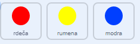

## Povečaj težavnost

Sedaj boš poskrbel, da bo igra postala težje, tem dlje jo igralec igra. To boš dosegel s tem, da se bodo pike pojavljale vedno hitreje.

--- task ---

Ustvari novo `spremenljivko`{:class="block3variables"} imenovano 'zamik'.


--- /task ---

--- task ---

Pojdi v program odra in ustvari novo zaporedje ukazov, ki nastavi spremenljivko `zamik`{:class="block3variables"} na `8` in nato počasi zmanjšuje vrednost spremenljivke `zamik`{:class="block3variables"}, medtem ko igra poteka.


```blocks3
    ko kliknemo na zastavico
  nastavi [zamik v] na (8)
  ponavljaj dokler  < (zamik) = (2)>
      počakaj (10) sekund
      spremeni [zamik v] za (-0.5)
  konec
```

--- /task ---

Morda si opazil, da je koda zelo podobna kodi, ki si jo uporabil za odštevanje časa!

V naslednjem koraku uporabi spremenljivko `zamik`{:class="block3variables"} v kodi figur 'rdeča', 'rumena', in 'modra'. 

--- task ---

Izbriši kodo, ki skrbi za to, da igra čaka naključno število sekund med ustvarjanjem dvojnikov figur pik. - počakaj (naključno število med (5) in (10)) sekund počakaj (zamik :: spremenljivke) sekund



```blocks3
- počakaj (naključno število med (5) in (10)) sekund
  počakaj (zamik :: variables) sekund
```

To naredi za vse tri figure.

--- /task ---

--- task ---

Preizkusi igro in preveri ali se pike začnejo premikati hitreje, dlje časa kot igra poteka.

+ Ali to deluje za vse tri barve pik?
+ Ali vidiš, kako se vrednost spremenljivke `zamik`{:class="block3variables"} manjša?

--- /task ---