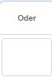
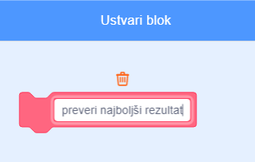

## Najboljši rezultat

Shranil boš najboljši rezultat, tako da bodo igralci vedeli, kako jim gre.

--- task ---

Ustvari novo spremenljivko imenovano `najboljši rezultat`{:class="block3variables"}.



--- /task ---

--- task ---

Izberi oder. Klikni na 'Moji bloki' in ustvari nov blok imenovan `preveri najboljši rezultat`{:class="block3myblocks"}.




--- /task ---

--- task ---

Tvojemu bloku dodaj kodo, ki preveri ali je trenutna vrednost spremenljivke `točke`{:class="block3variables"} večja od vrednosti `najboljši rezultat`{:class="block3variables"}in v tem primeru uporabi `točke`{:class="block3variables"}, kot novo vrednost spremenljivke `najboljši rezultat`{:class="block3variables"}.


```blocks3
    definiraj preveri najboljši rezultat
    if <(točke :: variables) > (najboljši rezultat)> potem
        nastavi [najboljši rezultat v] na (točke :: variables)
    konec
```

--- /task ---

--- task ---

Dodaj svoj novi blok v kodo odra v zaključek programa, pred koncem.


```blocks3
ko kliknemo na zastavico
nastavi [življenja v] na (3)
nastavi [točke v] na (0)
počakaj dokler ni <(življenja) < (1)>
+ preveri najboljši rezultat :: custom
ustavi [vse v]
```

--- /task ---

--- task ---

Dvakrat odigraj svojo igro, da vidiš ali se točke pravilno shranijo kot `najboljši rezultat`{:class="block3variables"}.

--- /task ---