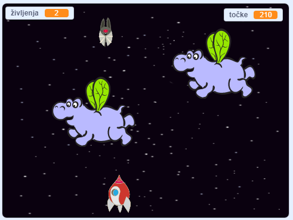

## Kaj sledi?

Preizkusi igro [Vojna klonov](https://projects.raspberrypi.org/en/projects/clone-wars?utm_source=pathway&utm_medium=whatnext&utm_campaign=projects), v kateri moraš rešiti Zemljo pred vesoljskimi pošastmi. V tem projektu boš lahko uporabil, kar si se naučil o podvajanju figur in točkovanju!

\--- no-print \---

Klikni na zeleno zastavico, da zaženeš primer igre, ki se nahaja spodaj in nato pritiskaj <kbd>levo</kbd> ali <kbd>desno</kbd> smerno tipko za premikanje vesoljske ladje in tipko <kbd>presedek</kbd> za streljanje.

  <iframe allowtransparency="true" width="485" height="402" src="https://scratch.mit.edu/projects/embed/276887163/?autostart=false" frameborder="0" scrolling="no"></iframe>
  

\--- /no-print \---

Doseži čim več točk s streljanjem letečih vesoljskih nilskih konjev. Če te zadene nilski konj ali pomaranča, ki jo mečejo netopirji, izgubiš življenje.

\--- print-only \---

\--- /print-only \---