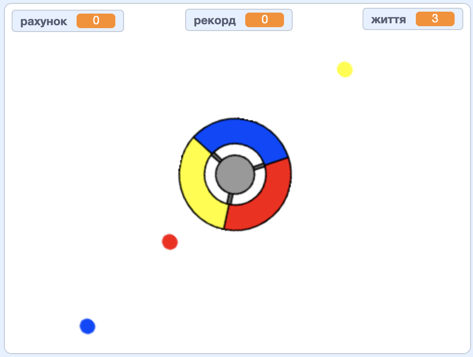

\--- no-print \---

Це — версія проєкту для **Скретч 3**. Також існує [версія проєкту для Скретч 2](https://projects.raspberrypi.org/en/projects/catch-the-dots-scratch2).

\--- /no-print \---

## Вступ

У цьому проєкті ти дізнаєшся, як створити гру, в якій гравець повинен ловити кольорові точки правильними кольорами на колесі контроллера.

\--- no-print \---

Використовуй клавіші клавіатури зі стрілками, щоб обертати колесо контроллера і лови літаючі точки кожного разу, коли вони досягають центра. Якщо пропустиш три точки, то гра закінчується.

  <iframe allowtransparency="true" width="485" height="402" src="https://scratch.mit.edu/projects/embed/252923761/?autostart=false" frameborder="0" scrolling="no"></iframe>
  

\--- /no-print \---

\--- print-only \---

\--- /print-only \---

## \--- collapse \---

## title: Чого ти навчишся

+ Як вибирати випадкові елементи зі списку
+ Як використовувати змінні для відстеження швидкості, життів та рахунку гравця

\--- /collapse \---

## \--- collapse \---

## title: Що тобі знадобиться

### Обладнання

+ Комп'ютер, що підтримує Скретч 3

### Програмне забезпечення

+ Скретч 3 (або [онлайн](http://rpf.io/scratchon){:target="_blank"}, або [офлайн](http://rpf.io/scratchoff){:target="_blank"})

### Завантаження

+ [Початковий офлайн-проєкт Скретч 3](http://rpf.io/p/en/catch-the-dots-go){:target="_blank"}

\--- /collapse \---

## \--- collapse \---

## title: Додаткові примітки для викладачів

\--- no-print \---

Якщо вам потрібно роздрукувати цей проєкт, будь ласка, скористайтеся [версією для друку](https://projects.raspberrypi.org/en/projects/catch-the-dots/print).

\--- /no-print \---

Ви можете знайти [завершений проєкт тут](http://rpf.io/p/en/catch-the-dots-get){:target="_blank"}.

Ви можете знайти [завершений проєкт тут](https://scratch.mit.edu/projects/252923761/#editor){:target="_blank"}

\--- /collapse \---