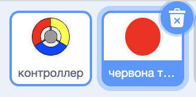
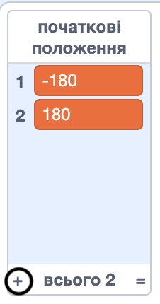

## Отримуй очки або витрачай житті

Тепер ти додаси точки, які необхідно ловити гравцеві.

--- task ---

Створи новий спрайт із назвою "червона точка". Цей спрайт повинен бути маленькою червоною точкою.



--- /task ---

--- task ---

Додай наступний скрипт до спрайта "червона точка", щоб створювати новий його клон кожні декілька секунд:


```blocks3
    when flag clicked
    hide
    wait (2) seconds
    forever
        create clone of (myself v)
        wait (pick random (5) to (10)) secs
    end
```

--- /task ---

Якщо ти зараз клацнеш на зелений прапор, то буде здаватися, що нічого не відбувається. Це через те, що всій клони заховані, і до того ж вони з’являються в одному й тому ж місці.

Ти додаси код, щоб кожен клон з’являвся в одному із чотирьох кутів Сцени.


--- task ---

Створи нови список із назвою `початкові позиції`{:class="block3variables"}, клацни на іконку `(+)` і додай значення `-180`{:class="block3variables"} та `180`{:class="block3variables"}.




[[[generic-scratch3-make-list]]]

Далі ти можеш приховати список, знявши виділення з цього пункту:


--- /task ---

Зверни увагу, що координати кутів Сцени — це комбінація `180` та `-180`. Це означає, що ти можеш використовувати цей список, щоб вибирати випадковий кут.

--- task ---

Додай цей код до спрайта точки, щоб кожен її клон з’являвся у випадковому куті, а далі повільно рухався до спрайта контроллера.


```blocks3
    when I start as a clone
    go to x: (item (pick random (1) to (2)) of [початкові позиції v]) y: (item (pick random (1) to (2)) of [початкові позиції v])
    point towards (контроллер v)
    show
    repeat until <touching (контроллер v)?>
        move (1) steps
    end
```

--- /task ---

Цей новий код вибирає `-180` або `180` для координат x та y, тобто кожен клон точки буде розпочинати із кута Сцени.

--- task ---

Перевір свій проєкт. Ти маєш побачити, як червоні точки з’являються в кутах Сцени і повільно рухаються до контроллера.


--- /task ---

--- task ---

Створи дві нові змінні з іменами `життя`{:class="block3variables"} та `рахунок`{:class="block3variables"}.


--- /task ---

--- task ---

Додай код до Сцени, щоб встановити на початку гри змінну `життя`{:class="block3variables"} рівною `3`, а `рахунок`{:class="block3variables"} рівним `0`. 


```blocks3
when flag clicked
set [життя v] to (3)
set [рахунок v] to (0)
```

--- /task ---

--- task ---

Додай цей код в кінці скрипта Сцени, щоб гра закінчувалася, як тільки гравець втрачає останнє своє життя:


```blocks3
    wait until <(життя :: variables) < [1]>
    stop [all v]
```

--- /task ---

Гравець має заробляти очки, ловлячи точки, і витрачати життя, коли йому це не вдається. Точка може бути спіймана лише тоді, коли колір контроллера відповідає кольору точки.

--- task ---

Повернися до області скриптів спрайта точки, щоб додати блоки коду в кінці скрипта `коли я починаю як клон`{:class="block3control"}.

Спочатку зроби, щоб клон точки `перемістився на 5 кроків`{:class="block3motion"} і таким чином перетнувся з контроллером.

Далі додай код, щоб або додавати `1` до `рахунку`{:class="block3variables"}, якщо колір клона точки дорівнює кольору на контроллері, якого вона торкається, або забирати `1` `життя`{:class="block3variables"}, якщо кольори різні.

[[[generic-scratch3-sound-from-library]]]


```blocks3
    move (5) steps
    if <touching color [#FF0000]?> then
        change [рахунок v] by (1)
        play sound (pop v) until done
    else
        change [життя v] by (-1)
        play sound (Laser1 v) until done
    end
    delete this clone
```

--- /task ---

--- task ---

Протестуй свою гру, щоб переконатися, що:

1. Ти витрачаєш життя, якщо точка попадає в неправильний колір
2. Ти заробляєш очко, якщо точка попадає правильно

--- /task ---