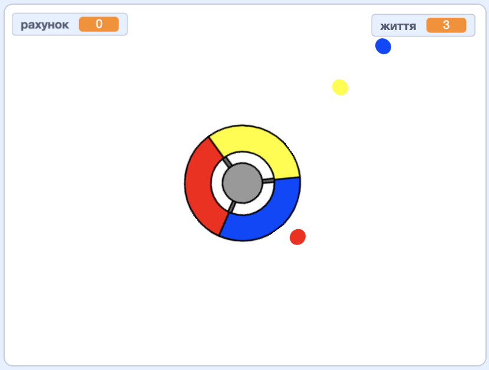

## Більше точок

\--- task \---

Продублюй двічі спрайт "червона точка" та назви два нових спрайти "жовта точка" і "синя точка".


\--- /task \---

\--- task \---

Зміни образ кожного з нових спрайтів, щоб вони були правильного кольору: "жовта точка" має бути жовтою, а "синя точка" — синьою.

\--- /task \---

\--- task \---

Зміни код кожного зі спрайтів, щоб для заробляння очок гравець мав попадати клоном точки в правильний колір на контроллері.



\--- hints \---

\--- hint \---

Ось код, який тобі треба буде знайти і змінити в обох нових спрайтах:


```blocks3
    if <touching color [#FF0000]?> then
        change [score v] by (1)
        play sound (pop v)
        ...
    end
```

\--- /hint \---

\--- hint \---

Ось як тобі треба змінити код для жовтого спрайта:

```blocks3
    if <touching color [#FFFF00]? :: +> then
        change [score v] by (1)
        play sound (pop v)
    end
```

Ось як тобі треба змінити код для синього спрайта:

```blocks3
    if <touching color [#0000FF]? :: +> then
        change [score v] by (1)
        play sound (pop v)
    end
```

\--- /hint \---

\--- /hints \---

\--- /task \---

If you play the game now, you can see that the dots sometimes get created on top of each other.

\--- task \---

Зміни код спрайта "жовта точка", щоб проходило чотири секунди між натисканням прапора та її появою.


```blocks3
    when flag clicked
    hide
+   wait (4) seconds
```


Далі зміни код спрайта "синя точка", щоб проходило шість секунд між натисканням прапора та її появою.

\--- /task \---