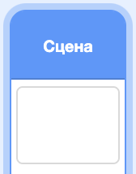
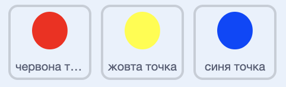

## Підвищи складність

Тепер ти зробиш, щоб гра з часом ускладнювалася. Ти досягнеш цього, зробивши появу точок в процесі все частіше.

\--- task \---

Створи нову `змінну`{:class="block3variables"} з назвою "затримка".



\--- /task \---

\--- task \---

Перейди в розділ коду Сцени і створи новий скрипт, який встановлює значення змінної `затримка`{:class="block3variables"} рівним `8`, а далі потроху зменшує його в процесі гри.


```blocks3
    when flag clicked
    set [delay v] to (8)
    repeat until < (delay) = (2)>
        wait (10) seconds
        change [delay v] by (-0.5)
    end
```

\--- /task \---

Зверни увагу, що цей код дуже схожий на той, що ти створював для таймера зворотнього відліку!

Далі використай змінну `затримка`{:class="block3variables"} в коді для спрайтів "червона точка", "жовта точка" і "синя точка".

\--- task \---

Видали блок коду, який змушує гру чекати випадкову кількість секунд між створеннями клонів спрайтів точок. Заміни блок, який ти видалив (-ла), новою змінною `затримка`{:class="block3variables"}:



```blocks3
<br />-   wait (pick random (5) to (10)) secs
    wait (delay :: variables) secs
```

Зроби це для усіх трьох спрайтів точок.

\--- /task \---

\--- task \---

Протестуй гру і перевір, чи точки починають з’являтися швидше в процесі.

+ Чи справджується це для всіх трьох кольорових точок?
+ Чи бачиш ти, як значення змінної `затримка`{:class="block3variables"} зменшується?

\--- /task \---