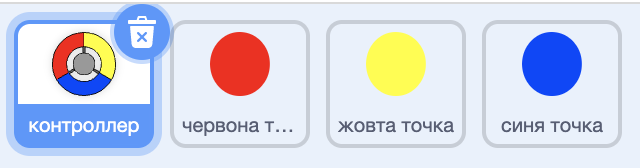

\--- challenge \---

## Завдання: Збільшення кількості крапок

Дублюємо двічі точку спрайт «червоний» та називаємо два нових спрайти «жовтий» і «синій».

Редагуємо ці спрайти (включаючи їх код), так що кожна кольорова точка повинна відповідати правильному кольору на датчику. Не забудьте протестувати свій проект, переконавшись, що ви отримуєте очки та втрачаєте життя в потрібний час, і що ваша гра не надто проста або занадто складна!

\--- /challenge \---