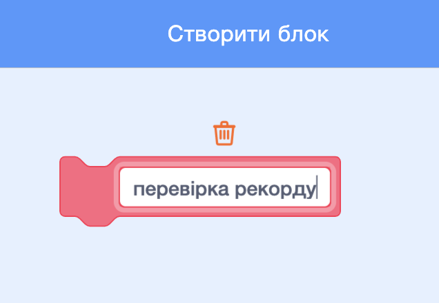
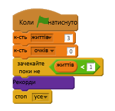

## Рекорд

Збережемо високий бал, щоб гравці могли бачити, наскільки добре вони виконують роботу.

+ Створіть список, який називається `рахунок`{:class="blockdata"}.

+ Нажміть на своїй сцені та створіть новий спеціальний блок під назвою ` перевірити високий бал </ 0> (: class = "blockmoreblocks").</p>

<p></p></li>
<li><p>Незадовго до закінчення гри додайте в новий спеціальний блок.</p>

<p></p></li>
<li><p>Додайте код до свого спеціального блоку, щоб зберегти поточні дані <code>score`{:class="blockdata"} as the `high score`{:class="blockdata"} `if`{:class="blockcontrol"}- це найвищий результат:
    
    ```blocks
        визначити [перевірити високий бал]
         якщо &lt <(оцінка)> (висока оцінка) &gt;&gt; потім
             встановити [високий бал v] (оцінка)
         кінець                &lt;
    ```

+ Перевірте доданий код. Відкрийте свою гру, щоб перевірити, чи правильно оновлено код `high score`{:class="blockdata"}.