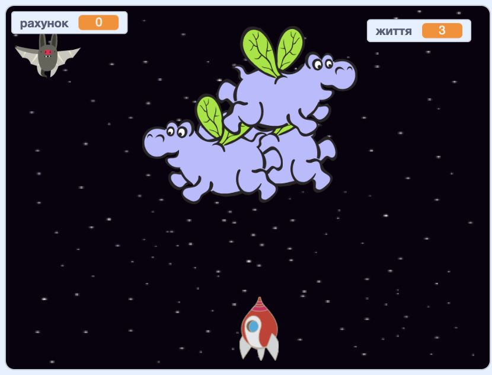

## Що далі?

Спробуй проєкт [Війни клонів](https://projects.raspberrypi.org/en/projects/clone-wars?utm_source=pathway&utm_medium=whatnext&utm_campaign=projects), щоб зробити гру, в якій тобі треба буде рятувати Землю від космічних монстрів. В ньому ти зможеш використати те, що ти дізнався (-лася) про клонування спрайтів та ведення рахунку!

\--- no-print \---

Для запуску клацни на зелений прапор у грі нижче, а далі натискай клавіші зі стрілками <kbd>вліво</kbd> та <kbd>вправо</kbd> для переміщення космічного корабля, а також клавішу <kbd>пропуск</kbd> для пострілів.

  <iframe allowtransparency="true" width="485" height="402" src="https://scratch.mit.edu/projects/embed/276887163/?autostart=false" frameborder="0" scrolling="no"></iframe>
  

\--- /no-print \---

Набери якомога більше очок, збиваючи літаючих космічних бегемотів. Якщо в тебе потрапить бегемот або апельсин, що скидається летючими мишами, ти витратиш життя.

\--- print-only \---

\--- /print-only \---