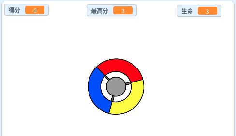

\--- no-print \---

这是**Scratch 3** 版本。 该项目还有一个[ Scratch 2版本](https://projects.raspberrypi.org/en/projects/catch-the-dots-scratch2) 。

\--- /no-print \---

## 介绍

在这个项目中，您将学习如何创建游戏，其中玩家必须将彩色点与控制轮的正确颜色进行匹配。

\--- no-print \---

Use the arrow keys on your keyboard to rotate the controller wheel and catch the flying dots as they reach the centre. 如果错过三个点，则游戏结束。

  <iframe allowtransparency="true" width="485" height="402" src="https://scratch.mit.edu/projects/embed/252923761/?autostart=false" frameborder="0" scrolling="no"></iframe>
  

\--- /no-print \---

\--- print-only \---

\--- /print-only \---

## \--- collapse \---

## 标题：您将学到什么

+ 如何从列表中选择随机项
+ 如何使用变量跟踪速度, 生命值和玩家分数

\--- /collapse \---

## \--- collapse \---

## 标题: 你需要准备什么

### 硬件

+ 一台能够运行Scratch 3的电脑

### 软件

+ Scratch 3 (either [online](https://rpf.io/scratchon){:target="_blank"} or [offline](https://rpf.io/scratchoff){:target="_blank"})

### 下载

+ [Offline Scratch 2 project](https://rpf.io/p/en/catch-the-dots-go){:target="_blank"}

\--- /collapse \---

## \--- collapse \---

## 标题: 给教师的附加说明

\--- no-print \---

如果您需要打印本项目文件，请使用[合适的打印版本](https://projects.raspberrypi.org/en/projects/catch-the-dots/print)

\--- /no-print \---

You can find [the completed project here](https://rpf.io/p/en/catch-the-dots-get){:target="_blank"}.

\--- /collapse \---