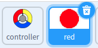
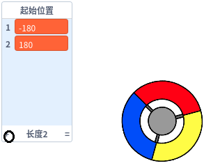
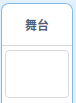

## 获得积分或失去生命

现在，您将添加玩家需要收集的一些点。

\--- task \---

Create a new sprite called 'red'. 这个精灵应该是一个小红点.



\--- /task \---

\--- task \---

Add this script to your 'red' sprite to create a new clone of the sprite every few seconds:


```blocks3
    when flag clicked
    hide
    wait (2) seconds
    forever
        create clone of (myself v)
        wait (pick random (5) to (10)) secs
    end
```

\--- /task \---

如果您现在单击绿色标志，则似乎没有任何反应。 这是因为所有的克隆精灵都被隐藏了, 并且他们出现在了相同的地方.

您将添加代码，让每个新克隆都出现在这个阶段的四个角之一的位置。


\--- task \---

Create a new list called `start positions`{:class="block3variables"}, click the list's `(+)` icon to add the values `-180`{:class="block3variables"} and `180`{:class="block3variables"}.




[[[generic-scratch3-make-list]]]

然后，您可以通过取消选中此框来隐藏列表：


\--- /task \---

注意对于舞台的每一个角坐标是`180` 和 `-180`. 这意味着你可以使用列表来随机选取舞台的一角.

\--- task \---

Add this code to the 'dot' sprite to make each new sprite clone appear in a random corner and then slowly move towards the controller sprite.


```blocks3
    when I start as a clone
    go to x: (item (pick random (1) to (2)) of [start positions v]) y: (item (pick random (1) to (2)) of [start positions v])
    point towards (controller v)
    show
    repeat until <touching (controller v)?>
        move (1) steps
    end
```

\--- /task \---

This new code chooses either `-180` or `180` for the x and y positions, meaning that each 'dot' sprite clone starts in a corner of the Stage.

\--- task \---

Test your project. 你可以看到红色小点出现在舞台一角并且向控制器缓慢移动.


\--- /task \---

\--- task \---

Create two new variables called `lives`{:class="block3variables"} and `score`{:class="block3variables"}.


\--- /task \---

\--- task \---

Add code to your Stage to set the `lives`{:class="block3variables"} variable to `3` and the `score`{:class="block3variables"} to `0` at the start of the game. 

```blocks3
when flag clicked
set [lives v] to (3)
set [score v] to (0)
```

\--- /task \---

\--- task \---

Add this code to the end of the Stage's script to make the game end when the player loses the last of the lives:


```blocks3
    wait until <(lives :: variables) < [1]>
    stop [all v]
```

\--- /task \---

玩家应因捕捉点而赢得积分，并因未能捕捉点而失去生命。 只能通过将控制器的颜色与点的颜色进行匹配来捕获点。

\--- task \---

Go back to the 'red' dot sprite's Scripts area to add some code blocks to the end of the sprite's `when I start as a clone`{:class="block3control"} script.

首先, 使小点克隆 `移动5步`{:class="block3motion"}以便重叠控制器.

然后添加代码,如果克隆小点的颜色匹配控制器的颜色,加 `1` 到 `score`变量{:class="block3variables"}, 如果没有匹配,则从`lives`{:class="block3variables"} 变量减去 `1`.

[[[generic-scratch3-sound-from-library]]]


```blocks3
    move (5) steps
    if <touching color [#FF0000]?> then
        change [score v] by (1)
        play sound (pop v) until done
    else
        change [lives v] by (-1)
        play sound (Laser1 v) until done
    end
    delete this clone
```

\--- /task \---

\--- task \---

测试你的游戏确保达到下面的效果:

1. 如果没有接到正确颜色的小点, 失去一条生命
2. 如果接到正确的小点, 加一分

\--- /task \---