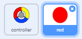
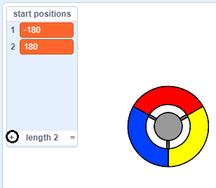

## 得分还是玩家失去生命值

现在你会加入一些玩家需要接到的点.

\--- task \--- 创建一个新的精灵叫做'red'. 这个精灵应该是一个小红点.



\--- /task \---

\--- task \--- 加入这个脚本到 'red' 精灵, 每隔几秒创建一个新的克隆精灵:


```blocks3
    when flag clicked
    hide
    wait (2) seconds
    forever
        create clone of (myself v)
        wait (pick random (5) to (10)) secs
    end
```

\--- /task \---

如果你现在点击绿色旗帜, 看上去好像什么也没有发生. 这是因为所有的克隆精灵都被隐藏了, 并且他们出现在了相同的地方.

你要加入代码使得每个新的克隆精灵出现在舞台的四个角之一的位置.


\--- task \--- 创建一个新的列表叫做 `start positions`{:class="block3variables"}, 点击列表的 `(+)` 图标添加值 `-180`{:class="block3variables"} 和 `180`{:class="block3variables"}.




[[[generic-scratch3-make-list]]]

你可以通过反选这个框隐藏列表:

 \--- /task \---

注意对于舞台的每一个角坐标是`180` 和 `-180`. 这意味着你可以使用列表来随机选取舞台的一角.

\--- task \--- 在'dot'精灵增加代码使每个精灵克隆出现在随机的一角并且想控制器精灵缓慢移动.


```blocks3
    when I start as a clone
    go to x: (item (pick random (1) to (2)) of [start positions v]) y: (item (pick random (1) to (2)) of [start positions v])
    point towards (controller v)
    show
    repeat until <touching (controller v)?>
        move (1) steps
    end
```

\--- /task \--- 这个新的代码选择或者是 `-180` 或者是 `180` 来设置x和y的位置, 意味着每个'dot'精灵克隆从舞台一角启动.

\--- task \--- 测试你的项目. 你可以看到红色小点出现在舞台一角并且向控制器缓慢移动.

 \--- /task \---

\--- task \--- 创建两个新的变量: `lives`{:class="block3variables"} 和 `score`{:class="block3variables"}.

 \--- /task \---

\--- task \--- 加入代码到舞台中,在游戏开始设置 `lives`{:class="block3variables"} 变量为 `3` 并设置 `score`{:class="block3variables"} 变量为 `0`. 

```blocks3
when flag clicked
set [lives v] to (3)
set [score v] to (0)
```

\--- /task \---

\--- task \--- 添加代码到舞台脚本末尾, 当玩家失去最后一条生命时使游戏结束:


```blocks3
    wait until <(lives :: variables) < [1]>
    stop [all v]
```

\--- /task \---

玩家会赢得接住小点的得分, 错过小点会失去生命值. 小点只能由控制器的匹配的颜色来捕捉.

\--- task \--- 回到'red'点精灵脚本,在精灵末尾加入一些`当启动克隆`{:class="block3control"}脚本时的代码块.

首先, 使小点克隆 `移动5步`{:class="block3motion"}以便重叠控制器.

然后添加代码,如果克隆小点的颜色匹配控制器的颜色,加 `1` 到 `score`变量{:class="block3variables"}, 如果没有匹配,则从`lives`{:class="block3variables"} 变量减去 `1`.

[[[generic-scratch3-sound-from-library]]]


```blocks3
    move (5) steps
    if <touching color [#FF0000]?> then
        change [score v] by (1)
        play sound (pop v) until done
    else
        change [lives v] by (-1)
        play sound (Laser1 v) until done
    end
    delete this clone
```

\--- /task \---

\--- task \---

测试你的游戏确保达到下面的效果:

1. 如果没有接到正确颜色的小点, 失去一条生命
2. 如果接到正确的小点, 加一分

\--- /task \---