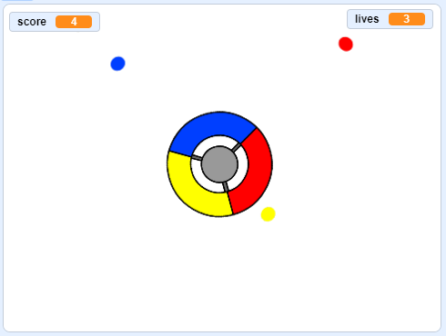

## 更多小点

\--- task \---

Duplicate your 'red' dot sprite twice, and name the two new sprites 'yellow' and 'blue'.


\--- /task \---

\--- task \---

Change the costume of each new sprite so it is the correct colour: the 'yellow' sprite should be yellow, and the 'blue' sprite should be blue.

\--- /task \---

\--- task \---

Change the code of each sprite so that the player has to match dot clone to the correct colour on the controller to score points.



\--- hints \---

\--- hint \---

This is the code you need to find and alter for both new sprites:


```blocks3
    if <touching color [#FF0000]?> then
        change [score v] by (1)
        play sound (pop v)
        ...
    end
```

\--- /hint \---

\--- hint \---

This is how you need to change the code for the yellow sprite:

```blocks3
    if <touching color [#FFFF00]? :: +> then
        change [score v] by (1)
        play sound (pop v)
    end
```

这是你需要为蓝色精灵修改的代码:

```blocks3
    if <touching color [#0000FF]? :: +> then
        change [score v] by (1)
        play sound (pop v)
    end
```

\--- /hint \---

\--- /hints \---

\--- /task \---

如果你现在玩游戏, 你可以看到小点有时会创建在其他小点身上, 同时创建多个小点.

\--- task \---

Change the code for the 'yellow' dot sprite so that it waits four seconds after the flag is clicked before appearing.


```blocks3
    when flag clicked
    hide
+   wait (4) seconds
```


然后修改'blue'小点精灵的代码以便在点击绿色旗帜后等待6秒才出现.

\--- /task \---