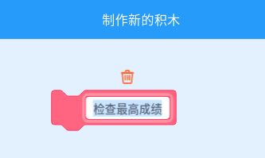

## 最高分

你要保存游戏的最高成绩, 以便玩家可以看到他们玩的有多好.

\--- task \--- 创建一个变量起名为 `high score`{:class="block3variables"}.


\--- /task \---

\--- task \--- 选择舞台. 点击 'My blocks' 并创建一个新的积木块称为 `check high score`{:class="block3myblocks"}.

 

\--- /task \---

\--- task \--- 在定制的代码块中加入代码以便可以检查当前的 `score`{:class="block3variables"} 变量值是否比`high score`{:class="block3variables"} 变量值更大, 然后把`score`{:class="block3variables"}变量座位新的值存在 `high score`{:class="block3variables"}变量中.


```blocks3
    define check high score
    if <(score :: variables) > (high score)> then
        set [high score v] to (score :: variables)
    end
```

\--- /task \---

\--- task \--- 将你的定制代码块添加到舞台精灵脚本的结束代码之前.


```blocks3
when flag clicked
set [lives v] to (3)
set [score v] to (0)
wait until <(lives) < (1)>

+ check high score :: custom
stop [all v]
```

\--- /task \---

\--- task \---

玩你的游戏两次检查是否成绩正确保存在了 `high score`{:class="block3variables"}变量中.

\--- /task \---