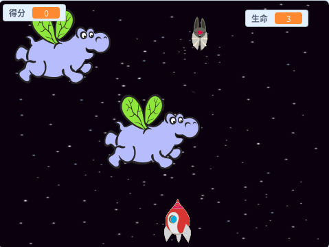

## 接下来还有什么？

尝试[克隆战争](https://projects.raspberrypi.org/en/projects/clone-wars?utm_source=pathway&utm_medium=whatnext&utm_campaign=projects)项目来制作一个游戏，你必须从太空怪物中拯救地球。 在那个项目中, 你可以使用你学到的克隆精灵能力并记分!

\--- no-print \---

点击下面的示例游戏中的绿色标志开始，然后按 <kbd>左</kbd>和<kbd>右</kbd> 箭头键移动飞船， <kbd>空格</kbd> 键来射击。

  <iframe allowtransparency="true" width="485" height="402" src="https://scratch.mit.edu/projects/embed/276887163/?autostart=false" frameborder="0" scrolling="no"></iframe>
  

\--- /no-print \---

你可以通过射击飞行中的太空船来获得分数. 如果你被河马击中或被蝙蝠投下的橘子砸中, 你就会失去一条生命.

\--- print-only \---

\--- /print-only \---