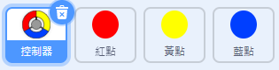
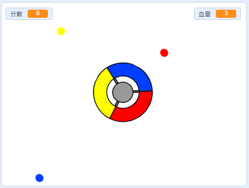

## 更多點點

--- task ---

複製你的「紅點」角色兩次，並將兩個新的角色分別命名為「黃點」和「藍點」。



--- /task ---

--- task ---

修改每個角色的造型，黃點的造型應該是黃色的，而藍點角色則是藍色造型。

--- /task ---

--- task ---

修改每個角色的程式，點點的顏色應該要與碰到的控制器色塊一樣才能得分。



--- hints ---


--- hint ---

下面是你要找到並替換的兩個角色的程式：


```blocks3
    if <touching color [#FF0000]?> then
		change [分數 v] by (1)
		play sound (pop v)
        ...
	end
```

--- /hint ---

--- hint ---

這是黃點角色程式要修改的程式：

```blocks3
    if <touching color [#FFFF00]? :: +> then
        change [分數 v] by (1)
        play sound (pop v)
	end
```

這是藍點角色的程式修改後的樣子：

```blocks3
    if <touching color [#0000FF]? :: +> then
        change [分數 v] by (1)
        play sound (pop v)
	end
```

--- /hint ---

--- /hints ---

--- /task ---

如果你現在試玩遊戲，應該會發現，有時不同色的點點會同時出現在一樣的角落。

--- task ---

修改黃點，讓它在綠旗點擊時等待 4 秒再出現。


```blocks3
    when flag clicked
	hide
+	wait (4) seconds
```


接著再修改藍點，讓它在遊戲開始後等待 6 秒再開始運行。

--- /task ---